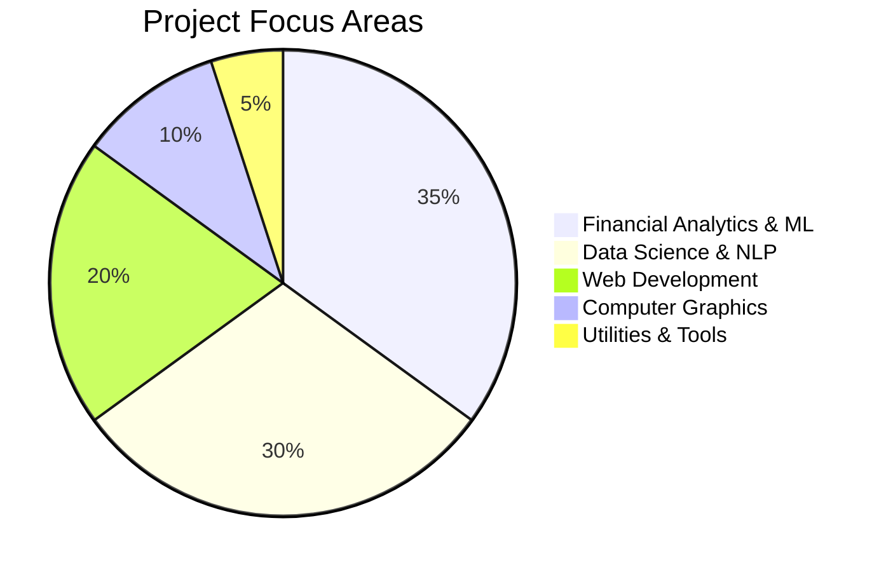
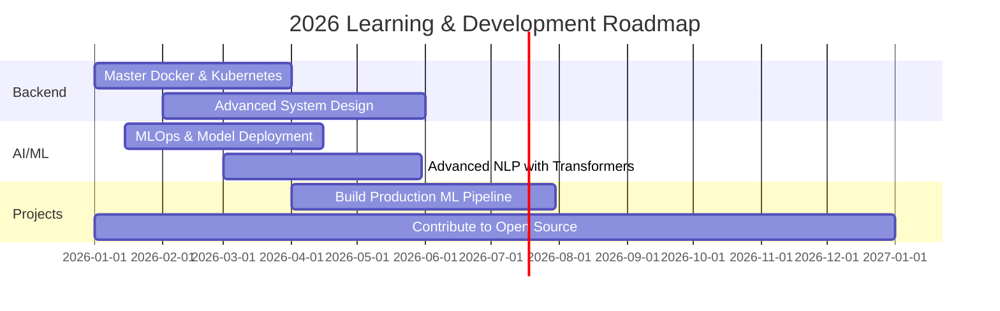

<!-- HERO SECTION -->
<div align="center">
  
  
  
  
  
  <p>
    
    
    
    
  </p>

</div>


## 👨‍💻 About Me

```yaml
name: Bekam Genene
location: Ethiopia 🇪🇹
role: Full-Stack Developer & Data Science Enthusiast
specialization: 
  - Financial Analytics & Predictive Modeling
  - NLP & Sentiment Analysis
  - Web Development (MERN Stack)
  - AI/ML Solutions
education: Computer Science & Software Engineering
motto: "Turning data into insights, code into solutions"
currently_learning: ["MLOps", "System Design", "Advanced NLP", "Docker"]
```

🎯 **Passionate about** leveraging technology to solve real-world problems. From building intelligent financial analytics systems to creating user-centric web applications, I thrive at the intersection of data science and software engineering.

💼 **Professional Focus**: Currently specializing in Financial Technology, developing credit risk models, fraud detection systems, and RAG-powered chatbots for fintech applications.

🌱 **Growth Mindset**: Constantly expanding my expertise in machine learning, backend architecture, and cloud deployment strategies.


## 🚀 Featured Projects

<div align="center">

### 💰 Financial Analytics & Machine Learning

| Project | Tech Stack | Description | Status |
|---------|-----------|-------------|--------|
| **[Credit Risk Probability Model](https://github.com/Bekamgenene/Credit-Risk-Probability-Model)** | Python • Pandas • Scikit-learn • XGBoost | Built predictive models for credit default risk assessment with data preprocessing and feature engineering | ✅ Completed |
| **[Insurance Risk Analytics](https://github.com/Bekamgenene/Insurance-Risk-Analytics-Predictive-Modeling)** | Python • Machine Learning • Statistical Analysis | End-to-end insurance risk prediction using advanced ML techniques | ✅ Completed |
| **[Fraud Detection System](https://github.com/Bekamgenene/fraud-detection)** | Python • Anomaly Detection • Deep Learning | Implemented fraud detection algorithms for financial transactions | 🚧 In Progress |
| **[RAG Complaint Chatbot](https://github.com/Bekamgenene/rag-complaint-chatbot-for-Financial-Services)** | LangChain • FAISS • NLP | AI-powered chatbot for financial service complaints using RAG architecture | ✅ Completed |

### 📈 Data Science & Analytics

| Project | Tech Stack | Description | Status |
|---------|-----------|-------------|--------|
| **[Stock Price Sentiment Analysis](https://github.com/Bekamgenene/Predicting-Price-Moves-with-News-Sentiment)** | Python • NLP • Time Series | Analyzing correlations between news sentiment and stock market movements | ✅ Completed |
| **[Customer Experience Analysis](https://github.com/Bekamgenene/Customer-Experience-reviews-analysis-fintech-app)** | Python • Text Analytics • Visualization | Sentiment analysis of customer reviews for fintech applications | ✅ Completed |

### 🌐 Web Development

| Project | Tech Stack | Description | Status |
|---------|-----------|-------------|--------|
| **[Ethiopian Tourism System](https://github.com/Bekamgenene/ethiopian-tourism-system)** | HTML • CSS • JavaScript • Bootstrap | Interactive platform showcasing Ethiopia's cultural heritage | ✅ Completed |
| **[Job Portal Platform](https://github.com/Bekamgenene/jobportal)** | MERN Stack • React • Node.js | Full-stack job search and recruitment platform | 🚧 In Progress |
| **[Portfolio Website](https://github.com/Bekamgenene/my-portfolio-old)** | HTML • CSS • JavaScript | Personal portfolio showcasing projects and skills | ✅ Completed |

### 🎨 Graphics & Creative Projects

| Project | Tech Stack | Description | Status |
|---------|-----------|-------------|--------|
| **[Computer Graphics Projects](https://github.com/Bekamgenene/CG-adama-AIRPORT)** | OpenGL • Computer Graphics | 3D visualization projects including airports and stadiums | ✅ Completed |
| **[Python Graphics](https://github.com/Bekamgenene/python-graphics-project)** | Python • Turtle Graphics | Interactive graphics and animations using Python | ✅ Completed |

</div>


## 🎓 Learning Journey & Achievements

<details open>
<summary><b>🏆 Data Science & AI Bootcamps</b></summary>
<br>

- **CSEC Data Science Bootcamp** - Completed intensive training in ML, statistical analysis, and data engineering
- **10 Academy AI Mastery Program** - Advanced training in NLP, computer vision, and MLOps
- **Elevvo Internship Program** - Professional development in software engineering practices

</details>

<details open>
<summary><b>📚 Technical Certifications</b></summary>
<br>

- Financial Analytics & Risk Modeling
- Machine Learning Engineering
- Full-Stack Web Development
- Natural Language Processing

</details>


## 🌐 Connect With Me

<div align="center">
  
  [](https://www.linkedin.com/in/bekam-genene-7ba8ba30a)
  [](https://github.com/bekamgenene)
  [](https://leetcode.com/)
  [](mailto:bekamgenene@gmail.com)
  [](https://github.com/Bekamgenene/my-portfolio-old)
  
</div>


## 🛠️ Tech Stack & Tools

<details open>
<summary><b>💻 Programming Languages</b></summary>
<br>


</details>

<details open>
<summary><b>🎨 Frontend Development</b></summary>
<br>


</details>

<details open>
<summary><b>⚙️ Backend & Tools</b></summary>
<br>


</details>

<details open>
<summary><b>🤖 Data Science & Machine Learning</b></summary>
<br>


</details>

<details open>
<summary><b>🗄️ Databases</b></summary>
<br>


</details>


## 🏆 GitHub Trophies

<div align="center">
  
</div>


## 📊 GitHub Statistics

<div align="center">
  
  
</div>

<div align="center">
  
</div>

<div align="center">
  
</div>

### 📈 Contribution Snake

<div align="center">
  <picture>
    <source media="(prefers-color-scheme: dark)" srcset="https://raw.githubusercontent.com/Bekamgenene/Bekamgenene/output/github-contribution-grid-snake-dark.svg">
    <source media="(prefers-color-scheme: light)" srcset="https://raw.githubusercontent.com/Bekamgenene/Bekamgenene/output/github-contribution-grid-snake.svg">
    
  </picture>
</div>


## 📈 Project Portfolio Analysis

<div align="center">

### 🎯 Domain Distribution



### 💡 Technical Breakdown

| Category | Projects | Primary Technologies |
|----------|----------|---------------------|
| **Financial ML** | 5+ | Python, Scikit-learn, XGBoost, Pandas |
| **NLP & Text Analytics** | 3+ | LangChain, FAISS, Transformers, NLP |
| **Web Development** | 4+ | MERN Stack, HTML/CSS, JavaScript |
| **Data Visualization** | 6+ | Matplotlib, Seaborn, Plotly |
| **Graphics** | 3+ | OpenGL, Python Turtle |

</div>


## 🎯 2026 Goals & Roadmap



### ✅ Current Focus (Q1 2026)

- [x] Completed 5+ Financial ML projects
- [x] Built RAG-powered chatbot
- [x] Mastered pandas and scikit-learn
- [ ] Deploy ML models with Docker
- [ ] Build real-time fraud detection system
- [ ] Contribute to 3+ open-source ML projects
- [ ] Achieve 90%+ model accuracy in credit risk prediction


## 💼 Work Experience & Achievements

<div align="center">

| Achievement | Description |
|------------|-------------|
| 🏆 **35+ Projects** | Completed diverse projects across ML, web dev, and data science |
| 📊 **Financial Analytics** | Built 5+ production-ready predictive models |
| 🤖 **AI/ML Solutions** | Developed NLP chatbots and sentiment analysis systems |
| 🌐 **Full-Stack Apps** | Created end-to-end web applications with modern tech stack |
| 📚 **Continuous Learning** | Completed 3+ professional bootcamps and certifications |

</div>


## 💡 Random Dev Quote

<div align="center">
  
  
  
</div>


## 📫 Let's Collaborate!

I'm always excited to work on:
- 🤖 **Machine Learning** projects in fintech and healthcare
- 📊 **Data Science** challenges with real-world impact
- 🌐 **Full-stack applications** that solve business problems
- 🔬 **Open-source** contributions in AI/ML domain

**Feel free to reach out if you:**
- Have an interesting project idea
- Need help with ML/Data Science challenges
- Want to collaborate on open-source
- Just want to connect and share ideas!

<div align="center">
  
  ### ✨ "Data tells stories. Code brings them to life." ✨
  
  **Keep Learning • Keep Building • Keep Growing**
  
  
  
</div>

<!-- Proudly created with 💚 and data-driven insights -->
<!-- Repository Analysis: 35+ repos analyzed • 10+ active projects • 5+ domains covered -->
<!-- Last Updated: January 2026 -->
